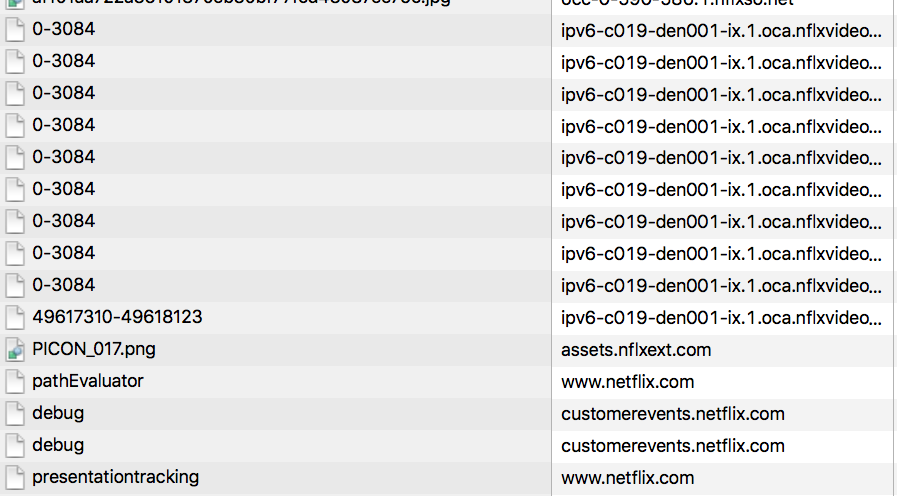

# AJAX
## Why am I making this video?
* AJAX is a difficult but necessary technique to grasp in web development
* It involves a lot of different ideas, and missing any one of them could mean confusion
* The FreeCodeCamp section is light on details
* It is much easier for many people to learn how to put complicated ideas to practice from watching videos than from reading, anyways
* This frustrates a lot of people who stop at the point where AJAX is required
* There are lots of AJAX related videos online, but they tend to be specific to one library or just Vanilla JS and can still leave students frustrated
* Other videos that are specific to FreeCodeCamp are just walkthroughs for the entire project, robbing students of the opportunity to learn

## What is AJAX, really?
* Asynchronous JavaScript and XML
* ... wut
* All this means is that we're getting more data from a server _after_ the initial HTML has been downloaded
* We frequently use this data to create more markup on the page, i.e. when listing a bunch of users or showing a customer's purchase history
* Here's a simplified roadmap of how a web app gets data

  Web browser requests index.html --------> freecodecamp.org (server)

  Browser receives index.html <------------ freecodecamp.org

  Browser requests everything
  linked to on index.html

                                            freecodecamp.org

                              script.js -->

                              style.css -->

                              image1.png ->

                              image2.png ->

                              fonts.woff ->

  Browser receives all
  requested resources
                              <------------ freecodecamp.org

  Browser runs the JavaScript
  in script.js

  (AJAX)

  JavaScript requests the user's
  data (finished challenges,
  profile pic, etc)
                              -------------> freecodecamp.org

  The server responds with data

                              <------------- freecodecamp.org

  The web browser uses this data
  to render a list of challenges,
  show the user's profile pic,
  display their bio, etc

* At its heart, an AJAX request is just an HTTP call, so we'll need to learn a little about HTTP

## HTTP
* HyperText Transfer Protocol
* A protocol is just a way to define how two parties interact, step by step
* There's a protocol in life for filing police reports, applying for college, buying a car, and more
* Computer protocols are important because they give machines exact instructions on how to act
* HTTP also defines what a correct message should look like, how to handle errors, and how to authenticate users
* In HTTP, there is always two parties - a client, which sends a request, and a server, which sends a response.
* Requests and responses are both HTTP messages
* In front end development, the client is almost always a web browser
* Most people are already familiar with the concept of a server. It's a computer "out there" in the internet that's waiting for a request from a client
* HTTP is stateless, meaning the server does not keep track of who the client is and each request must contain all the info the server needs to do its job
* An HTTP message - request _or_ response - has two major components (that we care about): the headers and the body
* Headers supply important information to the other party in a standard way so all servers can read the info without guessing where to look
* The body contains either data the client wants to deliver or data that the client requested from the server
* In some simple requests, the body is empty
* In the example above, there is a new HTTP request-response cycle every time the client requests a resource
* This means that there is a new header and optional body written out each time
* HTTP methods are a way to categorize requests which helps the server understand what it should do
* GET means "all I (the client) want is for you (the server) to give me some data and not change anything on your end in any way"
* POST means "I (the client) am giving you (the server) some data that I want you to use to create a new database entry with and store it"
* If the client sends an empty POST request, the server can throw an error. If the client sends an empty GET request, the server won't care because they're always empty
* Status codes are a simple way to describe the result of each request
* Anything 200 - 299 means success
* Anything 500 - 599 means server failure
* 3xx indicates redirect
* 4xx means client failure (404)

## Back to AJAX
* Most AJAX requests are simple GET requests
* The browser API and any AJAX library will handle the hard stuff
* Sometimes you'll need to set some headers
* Immediately, we're going to run into some security issues
* Same origin policy prevents the browser from running a script that didn't come from the site you originally visited
* Without this, a malicious script could access your account information if you haven't logged out
* SOP is something the _browser_ does to protect you
* CORS - Cross Origin Resource Sharing
* CORS is a formal method that allows a script to request data from another origin
* Simply, a server is configured to allow scripts from certain domains access to data
* For instance, Netflix uses a ton of different domains for all of their services

* Each server must be configured to allow requests from scripts that came from https://netflix.com
* Again, the browser is the one enforcing this policy, not the server
